# Credit Scorecard Modelling 
<p align="center">
    
    <p align="center">
        Figure 1: Credit Score Illustration (<a href="https://www.simmonsbank.com/siteassets/content-hub/learning-center/credit-score-image.jpg">Source</a>).
    </p>
</p>
## Business Context

Increased competition and pressures for revenue generation have led Bank XYZ to seek effective ways to find and attract new creditworthy customers while controlling their losses. Bank XYZ has launched an aggressive and massive campaign to reach a larger and more diverse group of potential customers, including those who may not have previously considered applying for a loan. This increase in the number of applicants means a greater proportion may have higher risk profiles. Currently, onboarding these new potential customers involves a manual credit risk assessment process, which is slow and inconsistent, often leading customers to seek loans from other banks.

Bank XYZ acknowledges this problem and aims to automate credit scoring to reduce turnaround times for customers. Additionally, customer service excellence demands that this automated process minimizes the denial of credit to creditworthy customers while filtering out as many potentially delinquent ones as possible. Furthermore, they want to provide a personalized experience or deals to each customer based on their credit scores. Therefore, an advanced credit scorecard model needs to be developed to tackle these issues and provide expandability to users such as risk managers, operational managers, and marketing managers.

## Business Objectives

The development of an advanced credit scoring model will help the bank:

1. **Automate Loan Approvals**: Make the loan approval process faster and more efficient.
2. **Manage Risk Better**: Accurately identify high-risk applicants to minimize defaults.
3. **Standardize Decisions**: Ensure consistent and objective loan approval decisions.
4. **Grow the Business**: Approve more loans to creditworthy customers to expand the customer base.
5. **Provide Personalized Experience**: Deliver personalized experiences and offers to both new and existing customers to enhance customer retention.
    
## Project Scope
For this project, the project scope will be:
1. Data: 
    Utilize Credit Bureau Data sourced from Kaggle. This dataset contains comprehensive information on loan applicants, including their credit history, demographic details, and financial behavior.
2. Deliverables:
    - Credit Scorecard Model: Logistic Regression Model trained using a Weight of Evidence.
    - Credit Scorecard: Create a scoring system derived from the model, which translates the predictive output into a standardized credit score. The calculation is done using the "points to double odds" method.
    - Credit Scorecard Coverage Table: Table containing model coverage on good customers and bad customers at each credit levels. 

## Tools and Python Packages
### Tools 
1. Code Editor: Visual Studio Code
2. Python Version: 3.10.13
3. Version Control: Git (useful for tracking changes and collaborating with team members)
4. Model Experiment: Jupyter Notebooks (for documenting and sharing code and results interactively)

### Python Packages 
1. Data Manipulation Packages used for handling and importing dataset such as `pandas` and `numpy`.
2. Data Visualization: Packages used for data visualization such as `matplotlib` and `seaborn`. 
3. Data Preprocessing: Packages used for binning process such as `optbinning`.  
4. Scorecard Modelling: Packages that were used to create a credit scorecard and a credit scorecard model model such as `scikit-learn`, and `optbinning`.
5. Model Evaluation: Packages that were used to evaluate model such as `scikit-learn`.
## Installation and Setup
For running the application locally, you can just use `anaconda` or `venv` but make sure the python version is 3.10.13. Then, install the the specified libraries inside `requirements.txt` 
```bash
  cd credit-scorecard-modelling
  pip install -r requirements.txt
```
## About the Data
|      **Feature Name**      |               **Description**               |
|:--------------------------:|:-------------------------------------------:|
| person_age                 | Age                                         |
| person_income              | Annual Income                               |
| person_home_ownership      | Home ownership                              |
| person_emp_length          | Employment length (in years)                |
| loan_intent                | Loan intent                                 |
| loan_grade                 | Loan grade                                  |
| loan_amnt                  | Loan amount                                 |
| loan_int_rate              | Interest rate                               |
| loan_status                | Loan status (0 is non default 1 is default) |
| loan_percent_income        | Percent income                              |
| cb_person_default_on_file  | Historical default                          |
| cb_preson_cred_hist_length | Credit history length                       |

## Exploratory Data Analysis
### How is the proportion of the response variable?

The response variable is unbalanced, with good customers (0) making up approximately **78.2%** and bad customers (1) making up about **21.8%**. This imbalance is common in the credit industry, as most users are not expected to default.
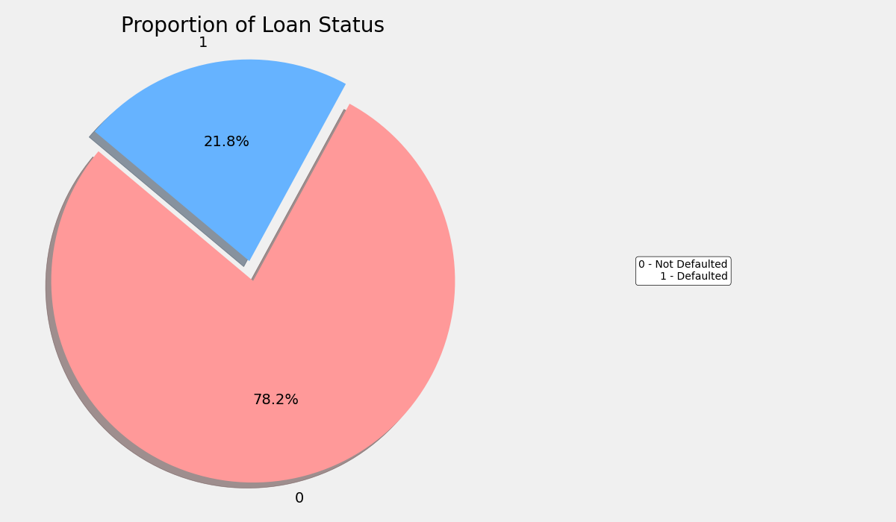

<p align="center">
    
    <p align="center">
        Figure 2: Proportion of Loan Status (from Author).
    </p>
</p>

### Are there missing values inside the predictor variables?
There are missing values in the `person_emp_length` and `loan_int_rate` explanatory variables.
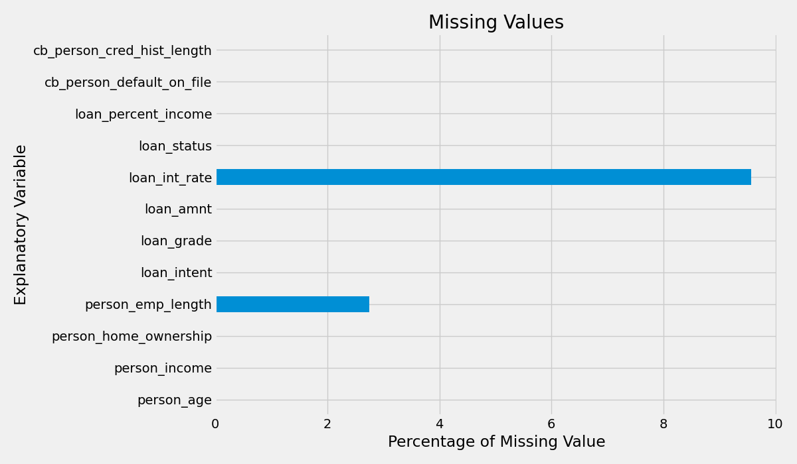

Missing values in `person_emp_length` may indicate unemployment or self-employment. To address this, they are filled with 0 values. Further analysis revealed that most applicants with missing `person_emp_length` have high loan_grade, with approximately 75% falling into grades A and B. This suggests they could be either business owners or unemployed with alternative income sources.
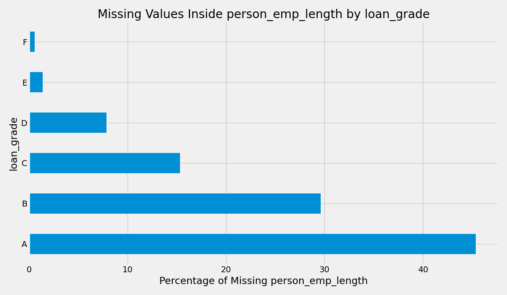

Missing values in `loan_int_rate` may result from human or system errors. Further investigation is needed to determine the cause. Perform mean or median imputation will be suffice.

**In this project using Weight of Evidence method it already handles missing data**.

### How is the distribution for the numerical predictor variable? Are there any outliers or anomalies?

**Positive outliers are observed in all predictor variables, resulting in right-skewed distributions. Some of these outliers are explainable**:
1. `person_income`: High net worth individuals (HNWIs) contribute to the skewness in income distributions.
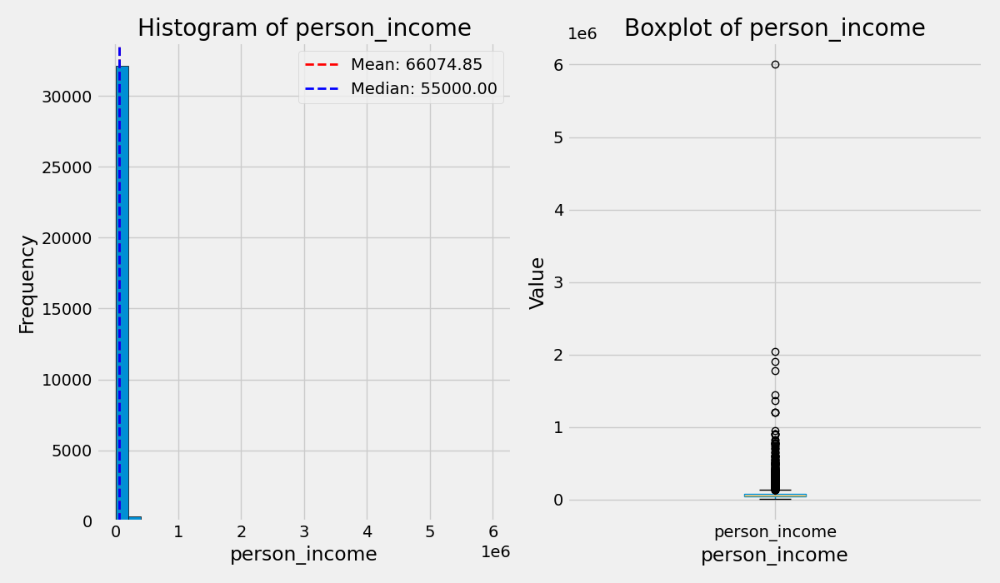
2. `loan_amnt`: customers with higher incomes may seek larger loan amounts.
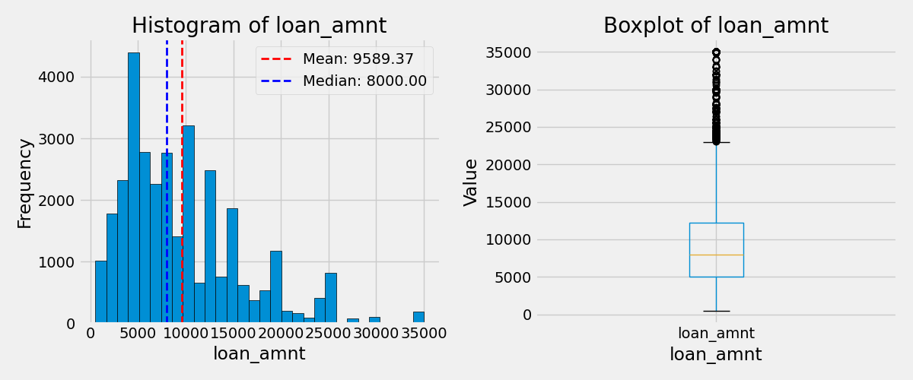
3. `loan_int_rate`: Higher loan interest rates may apply to customers perceived as high-risk.
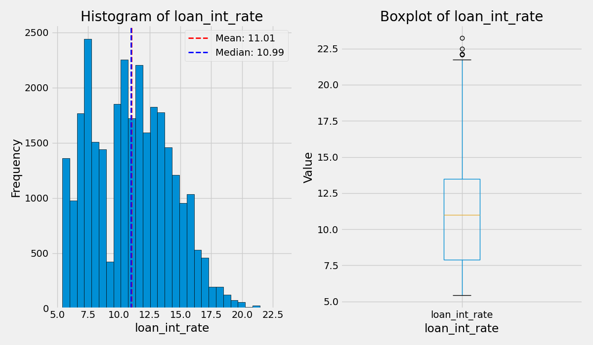
4. `loan_percent_income`: Some customers may request loans closer to their income percentage, potentially due to emergencies.
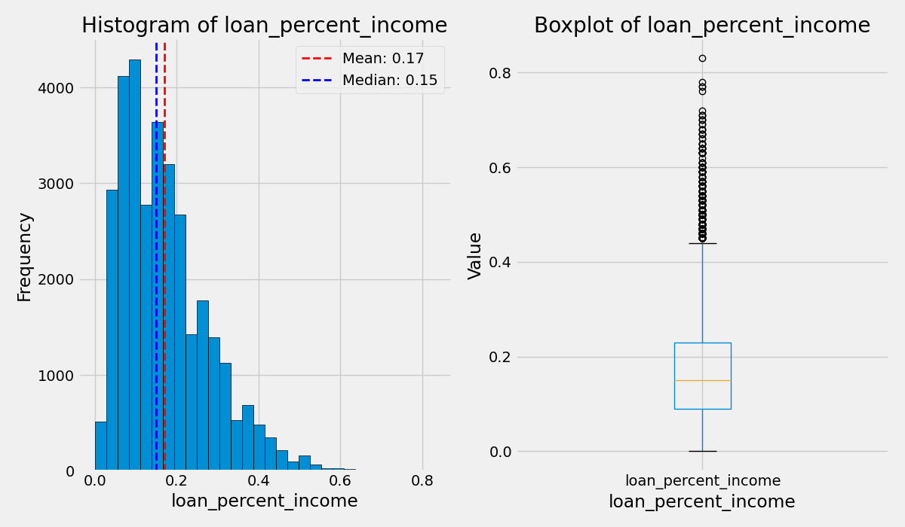
5. `cb_person_cred_hist_length`: Some individuals have exceptionally long credit histories.
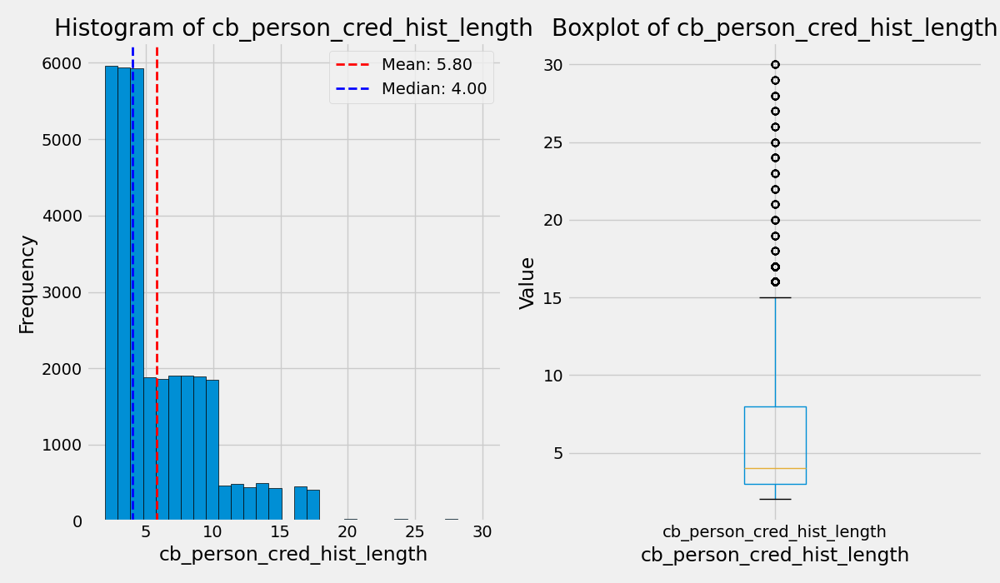

**Anomalies in the data include**:
1. `person_age`: While the oldest recorded individuals lived to 122 years, some entries in the dataset exceed this limit. To address this, records with `person_age` above 122 are removed, as they represent only a small fraction of the dataset (5 records).
```python
df[df["person_age"] > 122]
```
|       | **person_age** | person_income | person_home_ownership | person_emp_length | loan_intent | loan_grade | loan_amnt | loan_int_rate | loan_status | loan_percent_income | cb_person_default_on_file | cb_person_cred_hist_length |
|-------|------------|---------------|-----------------------|-------------------|-------------|------------|-----------|---------------|-------------|---------------------|---------------------------|----------------------------|
| 81    | **144**        | 250000        | RENT                  | 4.0               | VENTURE     | C          | 4800      | 13.57         | 0           | 0.02                | N                         | 3                          |
| 183   | **144**        | 200000        | MORTGAGE              | 4.0               | EDUCATION   | B          | 6000      | 11.86         | 0           | 0.03                | N                         | 2                          |
| 575   | **123**        | 80004         | RENT                  | 2.0               | EDUCATION   | B          | 20400     | 10.25         | 0           | 0.25                | N                         | 3                          |
| 747   | **123**        | 78000         | RENT                  | 7.0               | VENTURE     | B          | 20000     | NaN           | 0           | 0.26                | N                         | 4                          |
| 32297 | **144**        | 6000000       | MORTGAGE              | 12.0              | PERSONAL    | C          | 5000      | 12.73         | 0           | 0.00                | N                         | 25                         |

2. `person_emp_length`: It's impossible for loan applicants aged 21 and 22 to have worked for 123 years. To rectify this, replace these outlier values with the common employment duration for their age range.
```python
df[df["person_emp_length"] > df["person_age"]]
```
|     | person_age | person_income | person_home_ownership | person_emp_length | loan_intent | loan_grade | loan_amnt | loan_int_rate | loan_status | loan_percent_income | cb_person_default_on_file | cb_person_cred_hist_length |
|----:|-----------:|--------------:|----------------------:|------------------:|------------:|-----------:|----------:|--------------:|------------:|--------------------:|--------------------------:|---------------------------:|
|   0 |         22 |         59000 |                  RENT |             123.0 |    PERSONAL |          D |     35000 |         16.02 |           1 |                0.59 |                         Y |                          3 |
| 210 |         21 |        192000 |              MORTGAGE |             123.0 |     VENTURE |          A |     20000 |          6.54 |           0 |                0.10 |                         N |                          4 |

### How is the occurence of categorical predictor variable?
The occurences of:
1. `person_home_ownership` around 90% of loan applications still don't own a property or home where 50% of them is still renting and 40% of them still on mortgage.
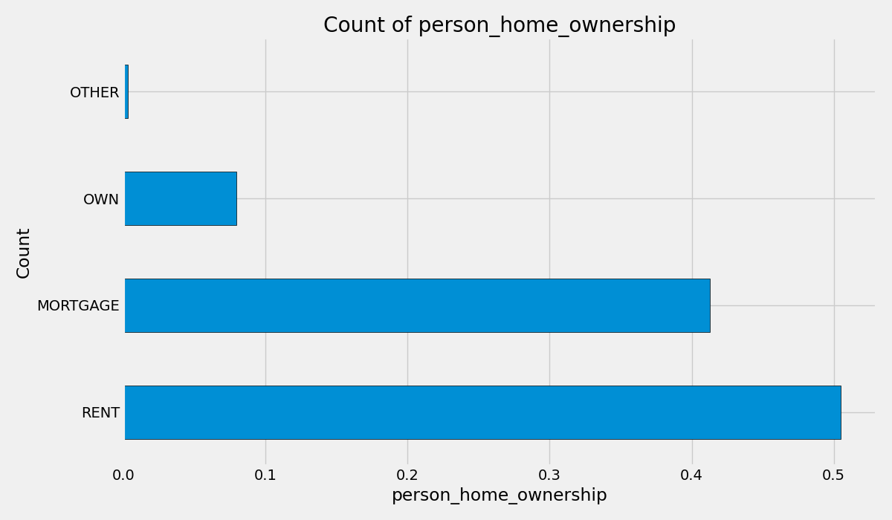
2. `loan_intent` are almost distributed evenly around each category.
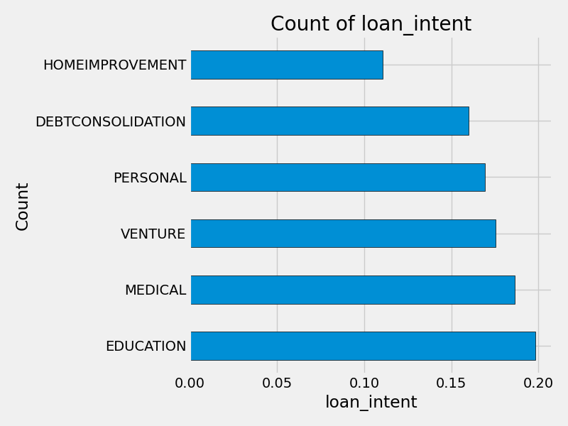
3. `loan_grade` around 65% of the loan applicants has a good loan grade, A and B.
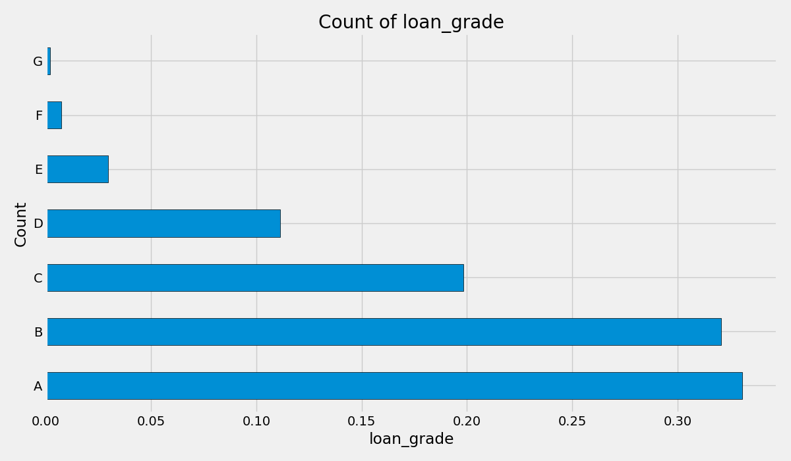
4. `cb_person_default_on_file` almost 20% of the customers had history of credit default. 
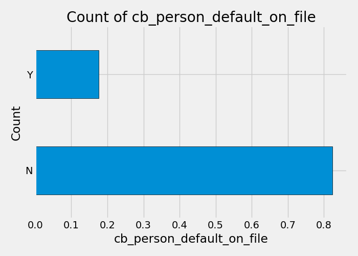

### What is the distribution of the numerical predictor variable across different classes of the response target variable?
Distributions of `loan_int_rate` and `loan_percent_income` vary based on the response variable, suggesting that higher values of these features correlate with a higher likelihood of default.
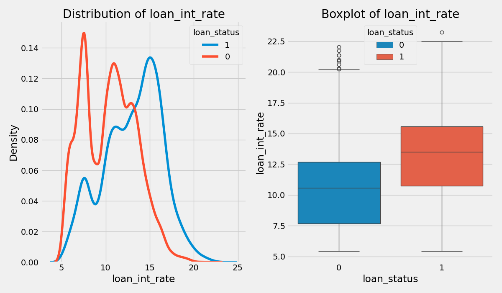
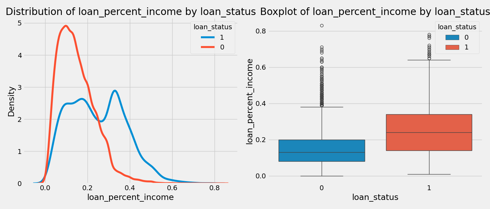

### Do certain categories of the categorical predictor variable have higher or lower probabilities of a specific class in the response variable?
1. `person_home_ownership`: The probability of default is highest among those who still **rent** (32%) and those with **other types** of home ownership (31%).
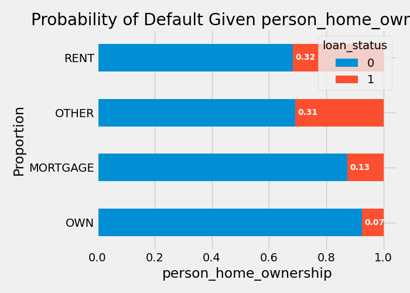
2. `loan_intent`: The probability of loan default is highest among those who took out loans for **debt consolidation** (29%), followed by **medical needs** (27%), **home improvement** (26%), **personal loans** (20%), **education loans** (17%), and **ventures** (15%).
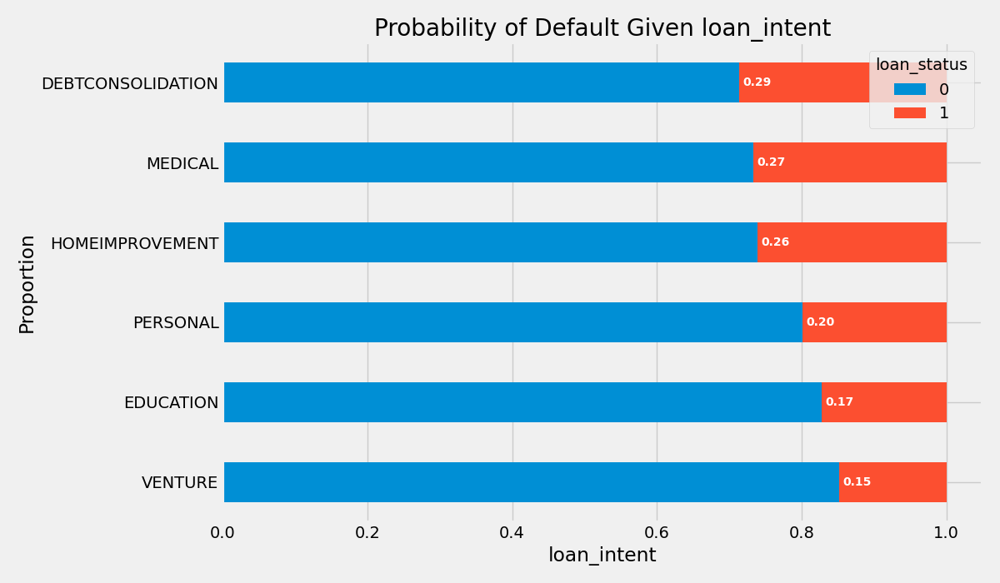
3. `loan_grade`: The probability of loan default is higher for those who has grade **G** (98%), **F** (71%), **E** (64%), and **D** (59%).
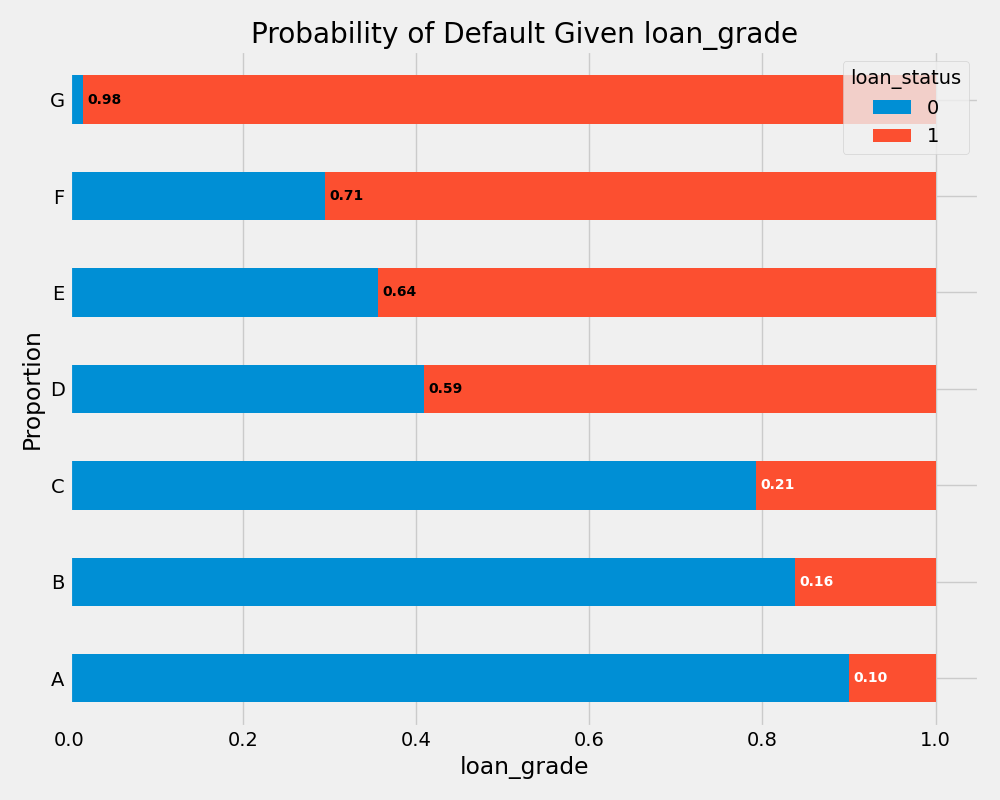
4. `cb_person_default_on_file`: The probability of loan default is higher for those who has history of default (38%).
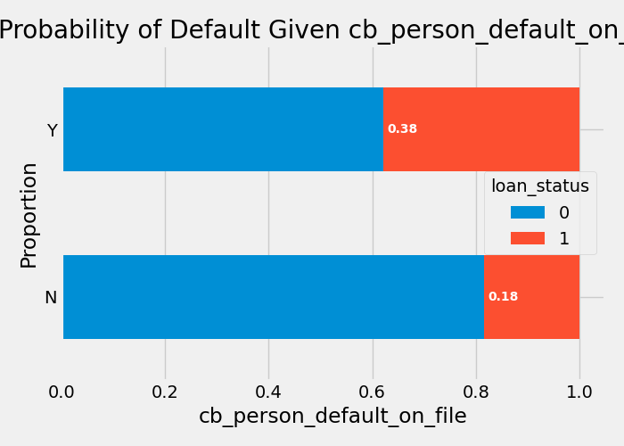

### How is the correlation amongst numerical predictor variable? (Multicollinearity)
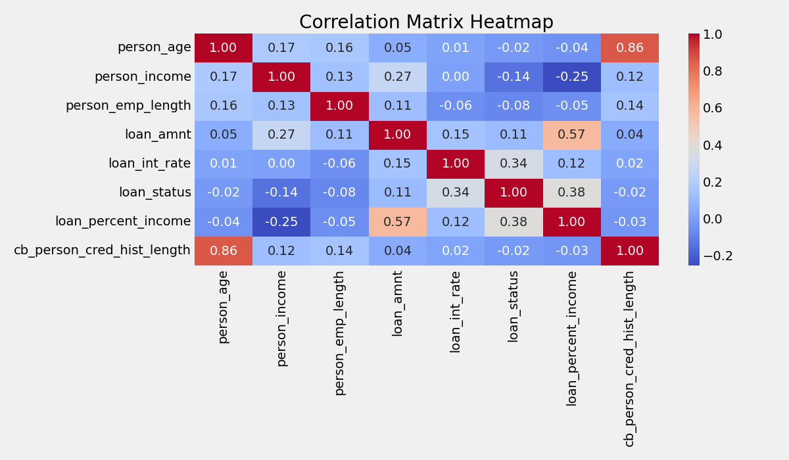
There are multicollinearity amongst numerical predictor variable, such as: `person_age` vs `cb_person_cred_hist_length` and `loan_amnt` vs `loan_percent_income`.


## Data Preprocessing
The whole process of data processing involve 4 steps: 
1. Data splitting
2. Weight of Evidence (WoE) and Information Value (IV)
3. Feature Selection
4. Data Transformation (Mapping predictors value with the Weight of Evidence values)

### Data Splitting
Split dataset into training set (70%) and test set (30%).

### Weight of Evidence (WoE) and Information Value (IV)
The order of this steps are perform binning for each predictors, calculate weight of evidence, and calculate the information value.

#### Binning
Binning is an operation used to convert continuous numerical data into a discrete/ categorical data. The original data values are divided into small intervals known as bins, and it is act as a bucket where multiple original values can be in the same interval/ bucket. Binning is not limited to numerical data in this context, the same process can be done on the categorical data values. Binning process for Weight of Evidence requires at least 5% of data are contained inside each bin.

#### Weight of Evidence 
WoE measures how good each grouped bins (inside a predictor variable) in predicting the desired value of the binary response variable (binary classification). The formula for calculating WoE is

$$\text{WoE} = \ln \left( \frac{\text{Proportion of Good}}{\text{Proportion of Bad}} \right)$$

Where:
- $\text{Proportion of Good}$ is the proportion of **good customers**.
- $\text{Proportion of Bad}$ is the proportion of **bad customers**.
- $\text{ln}$ denotes the natural logarithm.

Example results of calculting the Weight of Evidence is shown below (using `optbinning`)

|        |                  Bin | Count | Count (%) | Non-event | Event | Event rate |       WoE |       IV |       JS |
|-------:|---------------------:|------:|----------:|----------:|------:|-----------:|----------:|---------:|---------:|
|      0 |     (-inf, 22840.00) |  1142 |  0.050075 |       414 |   728 |   0.637478 | -1.840948 | 0.226646 | 0.024905 |
|      1 | [22840.00, 34990.00) |  3182 |  0.139525 |      1959 |  1223 |   0.384349 | -0.805386 | 0.109504 | 0.013330 |
|      2 | [34990.00, 39930.00) |  1636 |  0.071736 |      1195 |   441 |   0.269560 | -0.279657 | 0.006048 | 0.000753 |
|      3 | [39930.00, 59982.00) |  6349 |  0.278392 |      5000 |  1349 |   0.212474 |  0.033561 | 0.000311 | 0.000039 |
|      4 | [59982.00, 79942.50) |  4805 |  0.210690 |      4086 |   719 |   0.149636 |  0.460947 | 0.039009 | 0.004833 |
|      5 | [79942.50, 89325.00) |  1405 |  0.061607 |      1256 |   149 |   0.106050 |  0.855228 | 0.034628 | 0.004201 |
|      6 |      [89325.00, inf) |  4287 |  0.187977 |      3921 |   366 |   0.085374 |  1.094956 | 0.160225 | 0.019084 |
|      7 |              Special |     0 |  0.000000 |         0 |     0 |   0.000000 |       0.0 | 0.000000 | 0.000000 |
|      8 |              Missing |     0 |  0.000000 |         0 |     0 |   0.000000 |       0.0 | 0.000000 | 0.000000 |
| Totals |                      | 22806 |  1.000000 |     17831 |  4975 |   0.218144 |           | 0.576370 | 0.067146 |


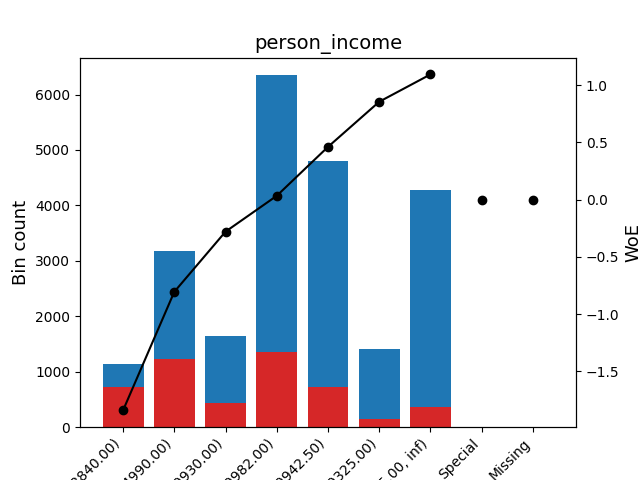

This plot shows that the higher the person income the higher the WoE that proves that the person is a Good Customer.

When we plot the WoE values, we want to look for monotonicity, which means the WoE values should either gradually increase or decrease.

**Why is Monotonicity Important?**

Monotonicity indicates a consistent, predictable relationship between the predictor variable and the response variable. This is particularly important for the following reasons:
1. Model Stability: Monotonic relationships lead to more stable and reliable models. Non-monotonic relationships can introduce noise and reduce the model's ability to generalize well to unseen data.
2. Interpretability: Monotonic WoE values make the model more interpretable. It is easier to explain that as the value of a certain variable increases, the risk of default increases (or decreases), which is intuitive for stakeholders.
3. Logistic Regression Compatibility: Logistic regression assumes a linear relationship between the independent variables and the log-odds of the dependent variable. Monotonic WoE values help to satisfy this assumption, as they reflect a more straightforward relationship that logistic regression can capture effectively.

#### Information Value
IV is used to measure the predictive power of the feature on the value of the specified binary response variable (0 or 1). The formula for calculating the IV is
$$\text{WoE} = \sum (\text{Proportion of Good} - \text{Proportion of Bad}) * \text{WoE}$$
Here is the table shows the interpretation of each IV.
| Information Value | Predictive Power                        |
|-------------------|-----------------------------------------|
| < 0.02            | Useless in modelling                    |
| 0.02 - 0.1        | Weak predictor                          |
| 0.1 - 0.3         | Medium predictor                        |
| 0.3 - 0.5         | Strong predictor                        |
| > 0.5             | Suspiciously good. Check further        |


Here is the result of the IV
|    |             Characteristic |       IV |         Interpretation |
|---:|---------------------------:|---------:|-----------------------:|
|  8 |        loan_percent_income | 0.953721 | Very Strong Predictive |
|  5 |                 loan_grade | 0.834618 | Very Strong Predictive |
|  7 |              loan_int_rate | 0.670894 | Very Strong Predictive |
|  1 |              person_income | 0.576370 | Very Strong Predictive |
|  2 |      person_home_ownership | 0.386377 |      Strong Predictive |
|  9 |  cb_person_default_on_file | 0.159914 |      Medium Predictive |
|  6 |                  loan_amnt | 0.095098 |        Weak Predictive |
|  4 |                loan_intent | 0.088282 |        Weak Predictive |
|  3 |          person_emp_length | 0.066238 |        Weak Predictive |
|  0 |                 person_age | 0.010358 |         Not Predictive |
| 10 | cb_person_cred_hist_length | 0.005744 |         Not Predictive |

### Feature Selection
For feature selection we will be selecting characteristic with the IV above 0.02. So based on the information value displayed in previous table. The features that will be used are:
1. loan_percent_income
2. loan_grade
3. loan_int_rate
4. person_income
5. person_home_ownership
6. cb_person_default_on_file
7. loan_amnt
8. loan_intent
9. person_emp_length

### WoE Transformation
After calculating WoE, we will be need to transform the original data values of each predictor into a Weight of Evidence values based on what bin that those original values belong to.


## Modelling
### Logistic Regression
Logistic Regression is a machine learning model used to predict outcome of a binary outcome. It shares similar concept with either linear regression of multiple linear regressions, except the outcome is binary (0s or 1s, True or False). The model still process input data using linear equation which will be mapped into a probability range between 0 and 1 using a logistic function. Logistic function is shown below
$$p=\frac{1}{1 + e^{-(\beta_{0} +\beta_{1}x_{1}+\beta_{2}x_{2}+...+\beta_{q}x_{q})}}$$

## Evaluation
Evaluation metrics used should assess the model's discriminative ability rather than conventional classification metrics like recall, precision, and F1-score. While recall, precision, and F1-score are useful in many classification contexts, credit risk models are often evaluated on their ability to rank-order risk and their calibration.
Key evaluation metrics for credit risk models include:
1. ROC AUC (Receiver Operating Characteristic Area Under the Curve): Measures the model's ability to distinguish between classes. It provides an aggregate measure of performance across all classification thresholds.
2. Precision-Recall Curve:Particularly useful in cases of imbalanced classes. It focuses on the performance related to the positive class (default cases).
3. Gini Coefficient:A variant of the AUC, often used in credit scoring, which ranges from 0 to 1. It measures the ability of the model to differentiate between good and bad accounts.
4. Kolmogorov-Smirnov (KS) Statistic:Evaluates the maximum separation between the cumulative distributions of the good and bad accounts. Higher KS values indicate better model performance.
5. Model Calibration: Assesses how well the predicted probabilities of default align with the actual default rates. Good calibration means that the predicted risk levels reflect true risks accurately.

These are the evaluation result from model training and testing. From the evaluation results, there's no indication of overfitting which is good due to similar model performances on both training and testing set.
| Metric  | Train              | Test               |
|---------|--------------------|--------------------|
| roc_auc | 0.8858853687426533 | 0.8865629623740199 |
| pr_auc  | 0.7689747230278872 | 0.7670910478214535 |
| gini    | 0.7717707374853067 | 0.7731259247480398 |
| ks      | 0.6375544257093894 | 0.6433699790912927 |

Take a look at the model calibration
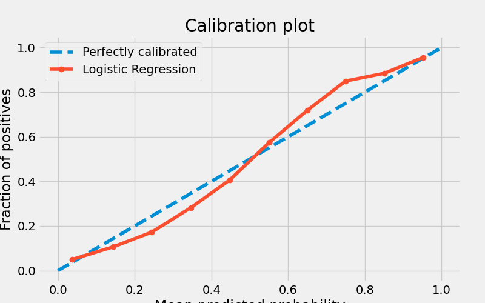
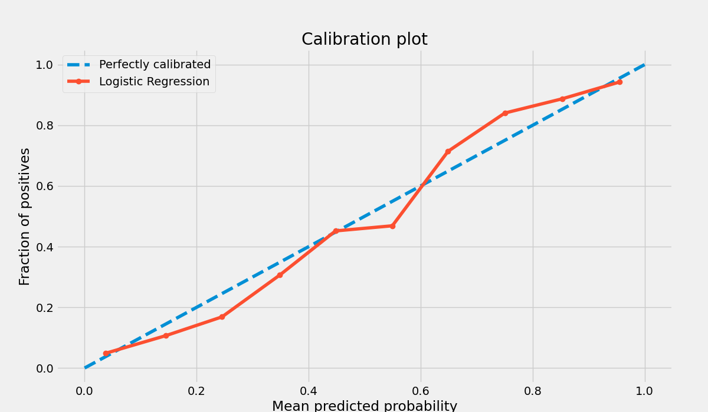
The most important thing is the model calibration which is close to the perfect calibrated line. Why is it so important? it ensures all business decision makers that the model estimated probabilities aligns with the actual default rate in the population of customers. For example, if the model is perfectly calibrated and the model predict that chance of someone default is 10% and the bank trust it. For every loan given to all customers with predicted probability of default 10%, then they expect on average that 10% of all customers will default.

## Credit Scorecard and Points Scaling
Credit Scorecard will show how points represented by the bins generated from the predictor variable. Generating the score points will involve scaling calculations from the logistic regression parameters and WoE(s) from grouped attributes inside each characteristics. The formula for calculating the points is:
$$\text{Attribute Score} = -(WoE_{j}*\beta_{i}+\frac{a}{n}) * Factor + \frac{Offset}{n}$$

We can calculate Factor and Offset by these formulas: 
$$\text{pdo} = Factor * \ln{(2)} \text{, therefore } Factor = pdo / \ln{(2)}$$
$$\text{Offset} = Score - {Factor * \ln(Odds)}$$

Where:
- $WOE$ = weight of evidence for each grouped attribute
- $\beta$ = regression coefficient for each characteristic
- $a$ = intercept term from logistic regression
- $n$ = number of characteristics
- $k$ = number of groups (of attributes) in each characteristic

The credit scorecard can be seen at reports\credit_scorecard.csv. Through this scorecard we can see how each attribute are represented in points. This will provide transparency on how customers are acessed for loan approval. If we used it on test data the distribution of the credit points by loan_status will be like this, which shows that almost all of the loan defaulters are those with low credit score.
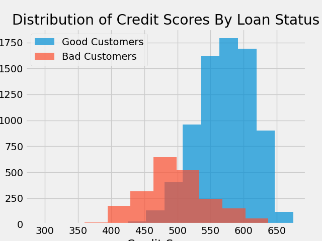

## Extra: Report to Management about The Credit Scorecard Modelling
This is only my own thoughts on what the management might want to know about the model.
|   | Credit Level | Credit Lower Bound | Credit Upper Bound | Credit Description | Customers | Customers Rate | good customers | bad customers | Default Rate | good customers Coverage | Loss Coverage |
|--:|-------------:|-------------------:|-------------------:|-------------------:|----------:|---------------:|---------------:|--------------:|-------------:|------------------------:|--------------:|
| 0 |            1 |               -inf |              350.0 |          Very Poor |       5.0 |       0.051151 |            0.0 |           5.0 |   100.000000 |                1.000000 |      0.218210 |
| 1 |            2 |              350.0 |              400.0 |               Poor |     116.0 |       1.186701 |            0.0 |         116.0 |   100.000000 |                1.000000 |      0.217810 |
| 2 |            3 |              400.0 |              450.0 |      Below Average |     405.0 |       4.143223 |           43.0 |         362.0 |    89.382716 |                1.000000 |      0.208411 |
| 3 |            4 |              450.0 |              500.0 |            Average |    1156.0 |      11.826087 |          326.0 |         830.0 |    71.799308 |                0.994373 |      0.178398 |
| 4 |            5 |              500.0 |              550.0 |      Above Average |    2113.0 |      21.616368 |         1622.0 |         491.0 |    23.237104 |                0.951714 |      0.101322 |
| 5 |            6 |              550.0 |              600.0 |               Good |    3335.0 |      34.117647 |         3077.0 |         258.0 |     7.736132 |                0.739466 |      0.055017 |
| 6 |            7 |              600.0 |              650.0 |          Very Good |    2421.0 |      24.767263 |         2350.0 |          71.0 |     2.932672 |                0.336823 |      0.026843 |
| 7 |            8 |              650.0 |              700.0 |          Excellent |     224.0 |       2.291560 |          224.0 |           0.0 |     0.000000 |                0.029312 |      0.000000 |

This report table is a summary of credit level statistics based on the count of Good Customer and bad customers inside each credit level.
1. **Credit Level**: This column indicates the different levels of creditworthiness.
2. **Credit Lower Bound and Credit Upper Bound**: These columns define the score ranges for each credit level. For example, the "Very Poor" credit level ranges from negative infinity (or the lowest possible score) up to 350.
3. **Credit Description**: This column provides a description or label for each credit level.
4. **Customers**: The number of customers or individuals falling within each credit level.
5. **Customers Rate**: This column might represent the percentage of customers in each credit level relative to the total number of customers.
6. **good customers and bad customers**: The number of customers within each credit level who are classified as "Good" (low credit risk) or "Bad" (high credit risk).
7. **Default Rate**: This column indicates the percentage of customers within each credit level who have defaulted on their obligations.
8. **good customers Coverage**: Cumulative percentage of "Good" customers covered within each credit level start from the highest credit level.
9. **Loss Coverage**: cumulative percentage of exposed losses that we are willing to accept for a given loan, starting from a certain credit level until the highes credit level.

With this report the management can easily understand the model performance especially on how the model covers good customers and also expected losses of accepting customer with certain credit level and above.

## References 
1. https://www.amazon.com/Credit-Risk-Scorecards-Implementing-Intelligent/dp/047175451X

## Improvement
- [ ] Refine README.md documentation
- [ ] Modularize the code from Python Notebook into Python Scripts.
- [ ] Create a machine learnign pipeline for automate training and testing process.
- [ ] Create an interactive website that allow to predict credit score based on input.
